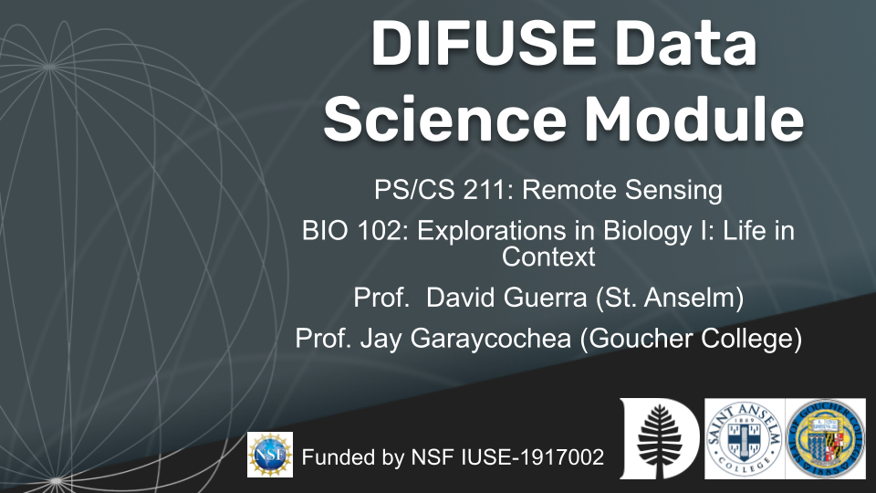

# BIOSAT 23W DIFUSE Module 

## Contributors: Andy Bean ('23), May Oo Khine ('23), Emma Nguyen ('25), David Guerra (Professor of Physics, Saint Anselm College), Jay Garaycochea (Professor of Biology, Goucher College), Professor Petra Bonfert-Taylor (Professor of Engineering, DIFUSE PI), and Professor Lorie Loeb (Professor of Engineering, DIFUSE PI)

This module was developed through the DIFUSE project at Dartmouth College and funded by the National Science Foundation award IUSE-1917002.

 This work is licensed under a <a rel="license" href="http://creativecommons.org/licenses/by-sa/4.0/">Creative Commons Attribution-ShareAlike 4.0 International License</a>.

## Module Description 
Professor Guerra's course, Remote Sensing, introduces students to working with ArcGIS and processing satellite imagery. Professor Garaycochea's course, Explorations in Biology I, introduces students to biological and ecological interactions. These courses intersect in the interactions between anthropological land use and the ecosystems that develop on that land. This module teaches data analysis and visualization on a data set in this domain: land use in Massachusetts, Connecticut, Maryland, and New Hampshire, and basic weather data, White-Tailed Deer Population, and the incidence of Lyme disease. Students are introduced to the data set and the goals of analysis in the pre-lab, and then are walked through the data in table format, map format, and PCA and k-means plots in the main lab assignment. These plots are interactively produced through the use of a Google Colab file running python script, while the lab and pre-lab assignments are Canvas quizzes which live in Canvas Commons.  

(<a href="https://github.com/difuse-dartmouth/.github/blob/8f8f6efff8943871e1fcaa3b6f2daf1531206df6/profile/howto.md">What does this badge mean?</a>)

## [Click here for module materials](completed_module/README.md)

For instructors and interested parties, the history of this repository (with detailed commits), can be found [here](https://github.com/difuse-dartmouth/BIOSAT_W23/commits/main/).

## Folder Structure

The folder *completed_module* contains all of the module components.  

The *components* subfolder contains links to the pre-lab and lab assignments, and contains a copy of the Colab file.

The *data* subfolder contains the JSON format shapefiles for creating the maps and the CSV data set for analysis. The data files *should not be moved* because their locations are hard-coded into the Colab for access. 

The *logistics* subfolder contains several documents which assist with understanding, using, and modifying this module if desired.

## Version History

03.19.2023 - This module was made public

04.05.2023 - The Colab file was updated to version 1.1 to fix an issue with the ipywidgets visualization of plotly figures. 

